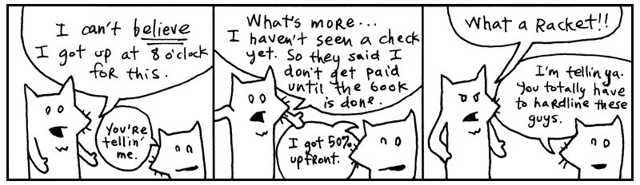
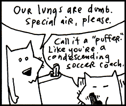
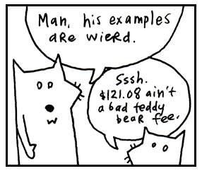
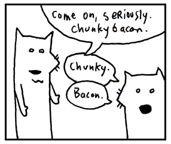
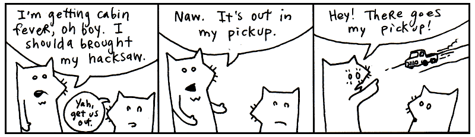
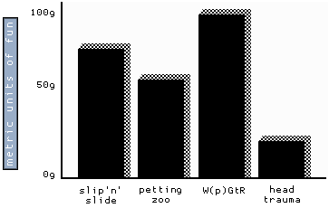

Yeah,就这两只。有点哮喘，我吸点药先，马上回来。

友情提示，看本章前最好先准备条手巾，方便擦泪嘛。

我们就快速通览下整个语言。就像拿个火柴盒，尽可能快的划光里面的火柴 -V-

## 1. 语言，我是说语言

凭良心说话，我不会把ruby当成一门*计算机*语言。看得出，计算机语言首先指的就是操作
计算机的语言——计算机是它的国度。我们程序员则是移民过来的外国人，为我们的世界做翻译。

不过，你觉得该怎样称呼这样的语言，你用这门语言的词汇表达文法表达自己的想法，
用它直接来思考？这能是计算机语言么？这个计算机做不了，这是我们的语言。

我们没有必要迷信*计算机*语言这样的说法，*代码民工才这么说*。它是我们思维的语言。

**把它大声念出来**


5.times { print "Odelay!" }


念单词，先无视标点符号（如引号，括号）什么的。这几个标点给单词赋予了含义，
帮助我们理解作者的本意。所以我们这么念：*打印"Odelay!"5次*

行如其文。Beck那[突变的西班牙][1]感叹句就会在屏幕上打印五遍。

**把它大声念出来**


exit unless "restaurant".include? "aura"


这是个简单的检查。我们的程序会**退出**（程序将要结束），**除非**这单词**restaurant**里面包含
（也就是**includes**）单词**aura**。好，再用英语来一遍：*Exit unless the word restaurant includes the words aura*
（*除非单词restaurant包含单词aura，否则程序退出*）。

见过哪门语言有这么用问号的没？ruby使用了些标点符号（如感叹号和问号）来提升代码的可读性。
就像上面的代码，我们既然是对代码提问题，那为啥不写的更清楚点？

**把它大声念出来**


['toast', 'cheese', 'wine'].each { |food| print food.capitalize  }


好吧，这段代码不如前两个那么像英语那么好读，不过我依然建议你念一遍。
Ruby有时是读着像英语，有时更像简化版英语。把上面的代码翻译成英语就是：
*With the words ‘toast’, ‘cheese’,and ‘wine’: take each food and print it capitalized*
（*把单词'toast','chees'和'wine'：每个食物以首字母大写打印出来*）。

然后电脑很有礼貌地回答道：'Toast','Cheese'和'Wine'。

这里你可能感兴趣，这些单词是怎么组到一块儿的。Somtchkkiss同学问了，这几个点和括号
是什么意思？我将要在下一节讨论各种*词性*。

目前为止你需要明白的就是，Ruby代码都是句子。这句子不一定是英文，而是表达你想法的
少许单词和符号组合。这些句子放到一起，可以编成书，可已编成论文，也可以编成小说。
这小说可以给人看，还可以给电脑看。

<aside>

## 关于这本(辛酸的)指南的商业使用

这本书使用知识共享协议发布，允许没有限制的商业使用这些文字。基本上，这意味着你可以
出售这些盗版我的书来获得收入。我相信我的那些读者（以及他们周围的世界）会来宰我。
把那些蹩脚的复印版装上久经考验的剪纸艺术作为封面。

朋友，法律是不值得头疼的。所以我是支持经过授权的盗版。任何想要读这本书的人都应该可以读到。
任何人想要卖这本书或者由这本书衍生出其他的版本，我荣幸之极。

我为什么要钱呢？忽略其他所有侧边栏:
我已经失去了想成为富裕笨蛋的愿望。听起来挺残忍，但是我们喜欢我的小黑白电视，
也喜欢我的悬挂式塑料灯。我不想成为一个职业的作家。现金不能激励我，那毫无意义。

所以，如果钱对我来说不意味着什么，为什么要在你做了商业实践之后又来狠狠地压碎我的灵魂
然后又扔下我一个人使用乌黑的铁肺喘息？哦，使用我的作品然后来讽刺我！该死的！尖酸刻薄的男孩！

为了解释我的意思，这里有一些可以杀死我的意志并强迫我重新思考生存意义的秘密内容。

**想法一: 大烟草公司**

买一个烟草公司。用我的卡通小狐狸燃烧起一股带侵略性的广告活动。
以这个广告牌作为开胃菜：

把目标市场定位为儿童和气喘病患者。然后，一旦事情进展顺利，那些
知道**真相**的人们就开始揭发我和我那农场上漆黑的狐狸。

> **明智的行家控制城市的荒野**：他称自己为幸运的尸体。

> （拉起窗帘，露出轮床上灰色的尸体）

> **行家**: 有些尸体并没有那么走运.

> （不稳定的放大。叠加卡通狐狸成为Willy Wonka潜意识上的心灵之旅。）

哟，为什么你非要弄这样烟雾缭绕，就像那福尔摩斯一样？

**想法二: 嘿, 团队激励**

如我所说，开始卖我的盗版书，但是腐败我的文字。这些改变了的副本将包含大量的
公开（和诽谤）引用政府机构，如美国执法官和五角大楼。你可以让我看起来想一个
彻底的叛徒。就像我有这些计划一样：杀害有些不和人意的美国政府或五角大楼的官员。

我并不是说美国执法官或者五角大楼的官员有什么不和人意的地方。是的，我不是那个意思。

哦，废话。

哦，废话。哦，废话。哦，废话。

把灯关掉。下来。

**想法三: 广告牌, 第二部分**

关于哮喘的直接乐趣？

**想法四: 亚力克 鲍德温**

把这本书改编成电影。然后，你知道，我是这本书的一个角色，你可以找一个像Alec Baldwin
的演员来演我。他正在职业生涯一个困难时期。

你可以使他看起来像我一样在吸毒品。像我一样疯癫。像我一样把人们锁在摩托车房间，
让他们穿着面包做的衣服，然后一直放火烤他们。是的，像我这样把人们*烘焙*成衣服。

你可以制造一个巨大的模具，把人们赶到里面去。然后，我倒入所有的面团开始烘烤，
直到面团已经上升，他们已经几乎死亡。而当摄制组把我请到美国早间新闻节目时，
他们会问，“那么，在你制作书的过程中你雇了多少员工呢？”然后我回答道，“一打面包师！”
并爆发出疯狂的大笑声，这将迫使观众举起手来捂住耳朵。

当然，在我疯狂挣扎的时候，我将向世界宣战。面包人将要参加相当多的战斗。直到美国执法官
（或者五角大楼）设计一个巨大的猴子大脑机器人（由Burt Lancaster饰演）来和我作战。

在这里你将使我看起来完全就像一个瘸子一样。我不仅要牺牲所有的面包人（星河战队）以
拯救自己，我不仅要像一个懦夫一样从巨猴大脑手里逃脱，而且当我勉强的逃离时，我还要
骂观众。坚持不懈的尖叫，这是*我的*电影，没有人会再看到它，我将撕裂一半屏幕，电影放映机
将在破烂的卷轴中旋转。而且那就是电影的结尾。人们将*非常*愤怒。

现在，我得思考。你看，实际上，Alec Baldwin在*特南鲍姆一家*中做一个体面的旁白。
他的职业生涯可能是正确的。你可能不想用他，他可能也不想做这个。

告诉你。我要做好这个角色。我已经走出了职业生涯的最低点。

{{ sidebar | markdownify }}
</aside>

## 2. 词性

就像臭鼬背部的白色条纹，新娘飘动的白裙一样，ruby的很多词性都有特别的视觉提示，以帮助你
识别它们。标点符号和大小写将帮助你的大脑很好的辨别看到的代码。你会在心里大喊*嘿，我认识这家伙！*
你也可以在与其他Ruby爱好者谈话中这样来提高自己的身份。

尝试着关注每个词性的长相。下面本书将详细的介绍这些特性。我给每个词性都归纳了一些简短的描述，
你不需要理解那些解释。在这章的结尾，你应该能够认识Ruby语言的每个词性。

### 变量

在ruby中每个普通的小写单词都是一个变量。变量可能由字母、数字和下划线组成。

例如：`x`, `y`, `banana2` 或者 `phone_a_quail` 。

变量就好比一个昵称。还记得过去人们都叫你臭Pete吗？人们可能说，“走开，臭Pete!”
并且所有人都奇迹般的知道臭Pete就是你。

变量，就是你给频繁用到的东西取个昵称。比如，我们假设你开了一个孤儿院。这是一个吝啬的孤儿院。
每当Warbucks爸爸过来领养孩子时，我们坚持让他付给我们**一百二十一美元八美分**来购买孩子的泰迪熊，
那是孩子在黑夜中和在这噩梦般环境中的唯一依赖。


teddy_bear_fee = 121.08


后来，让你让他在收银机（一个运行ruby程序的强大马力的收银机）上按下按钮时，
你需要将所有的费用加起来作为**总额**。


total = orphan_fee + teddy_bear_fee + gratuity


那些变量的昵称当然有帮助。而在破旧的地下销售儿童过程中，我保证任何帮助都将获得赞赏。

### 数字

数字中最基本类型就是*integer*了，以**加号或减号**开头的**一连串的数字**。

例如：`1`, `23`, 和 `-10000`。

逗号是不允许出现在数字中的，但是可以用下划线代替。所以如果你觉得需要在数字中用千位分开，
那就使用下划线吧。


population = 12_000_000_000


在Ruby中浮点数叫做*floats*。浮点数包含**小数点**或者使用**科学计数法**。

例如：`3.14`, `-808.08` 和 `12.043e-04` 。

### 字符串

字符串是使用引号包起来的任意多个字符（字母，数字，标点符号）的组合。**单引号和双引号**
都可以用来创建字符串。

例如：`"sealab"`, `'2021'`, 或者 `"These cartoons are hilarious!"` 。

当你把字符放到引号中，他们被一起保存成一个单独的字符串。

想想一个记者粗略的记录一个名人的闲谈。”我是多么的聪明，“Avril Lavigne说道。
”现在我知道商业是什么了——你必须要做哪些事并且怎么去做。“


avril_quote = "I'm a lot wiser.  Now I know
what the business is like -- what you have
to do and how to work it."


所以，就像我们保存一个数字在变量**teddy_bear_fee**中一样，现在我们正在保存一个
字符集合（字符串）到变量**avril_quote**中。那个记者把这段引用输入打印机，他碰巧
使用Ruby来处理打印操作。


print oprah_quote
print avril_quote
print ashlee_simpson_debacle


### 名字

名字就和变量看起来差不多。同样，他们也是由字母，数字或者下划线组成。但是，他们是
由**由冒号开头**。

例如：`:a`, `:b`, 或者 `:ponce_de_leon` 。

名字是轻量级的字符串。通常，symbols使用在你需要一个字符串但是不会把它打印在屏幕的情况下。

你可以说一个名字可以更简单的在电脑中使用。它就像一个抗酸剂。那个冒号表示气泡在你计算机的肠胃中
缓缓上浮就像它消化了symbol一样。啊，甜美，甜美的救济。

### 常量

常量的单词就像变量一样，但是常量是**大写的**。如果变量是Ruby的名词，那么把变量想象成专有名词。

例如：`Time`, `Array` or `Bunny_Lake_is_Missing` 。

在英语中，专有名词是大写的。The Empire State Building（帝国大厦）。你不能移走帝国大厦。
你甚至不能把帝国大厦想象成其他事物。专有名字就像那样。他们指代那些非常特别并且通常不会因为时间改变的事物。

同样的道理，常量在赋值之后也不能被改变。


EmpireStateBuilding = "350 5th Avenue, NYC, NY"


如果我们试图改变常量，Ruby会抱怨我们。这样的事情是不推荐的。

### 方法

如果把变量和常量比作名词，那么方法可以比作动词。方法通常是在变量或者常量的后面并且通过一个**点**
连接。你已经看到方法在工作了。


front_door.open


上面的代码中，**open**就是方法。它是一个行为，是个动词。在一些情况在，你将看到一些行为连接在一起。


front_door.open.close


我们已经指示电脑把前门打开，然后再立刻把门关上。


front_door.is_open?


上面也是一个行为。我们正在指示电脑去检查门是否敞开的。这个方法可以这样写
`Door.test_to_see_if_its_open`,但是`is_open?`更加简明而且也是正确的。感叹号和
问号也可能出现在方法名中。

### 方法参数

一个方法可能需要更多的信息去执行它的行为。如果我们想要电脑去给门喷漆，我们应该提供颜色。

方法参数在方法名的末尾。参数经常被**括号**包围，并且被**逗号**分开。


front_door.paint( 3, :red )


上面的代码给前门涂上了3个红色的外套。

你可以把这想象成方法正在沿着内轮胎边缘拉动，包括他的额外指令。括号是带着内管的湿气。
那些逗号是每个参数的脚，贴在边缘。最后一个参数把它的脚盘着在，我们就不展示了。

带着方法的参数连接在一起，就像一艘船拉着许多内胎。


front_door.paint( 3, :red ).dry( 30 ).close()


上面的代码把前门涂上3件红色的外套，烘干20分钟，然后关上门。即使最后一个方法没有参数，
如果你愿意的话也可以加上括号。拖着一个空的内胎也没有什么意义，所以那个括号通常都省略掉。

有些方法（例如`print`）是核心方法。这些方法是在Ruby中自始至终都会用到。以为他们太常见，
你可以不适用点来引用。


print "See, no dot."


### 类方法

就如上面描述的方法（也叫*实例*方法）一样，类方法也是经常在变量和常量后面。
这里不是使用点，而是使用**双冒号**来引用。


Door::new( :oak )


如上面看到的，这个`new`类方法经常用来创建事物。在上面的例子中，我们正在请求Ruby
来为我们创建一个新的橡木门。当然，Ruby必须能够理解怎样制造一个门——也是就大量的木材，
伐木工人和那些长长的扭动的二人锯片。

### 全局变量

那些以**美元符号**开头的变量是全局的。

例如：`$x`, `$1`, `$chunky` 和 `$CHunKY_bACOn` 。

大部分变量本质上都是临时的。你程序的某些部分就像是一个小房子，你走进去看到他们有自己的变量。
在一个房间里，你可能有一个`dad`代表着Archie,一个旅行推销员和一个古玩收藏家。
在另一个房间，`dad`可以代表Peter,一个爱穿法兰绒的训狮者。每个房间都有对于`dad`自己的意思。

使用全局变量，你能够保证这个变量在每个小房间里都代表相同的意思。美元符号是非常合适的。
每个美国家庭都认同美元的价值。我们为之疯狂的东西。在美国，试着敲任何一扇门，然后给他们现金。
我敢保证，如果你敲门并给他们热爱法兰绒的驯兽师Peter，肯定不会得到相同的反应。

全局变量可以用在程序的任何地方。他们永远不会淡出人们的视野。

### 实例变量

那些以**@**标识符开头的变量称为实例变量。

例如：`@x`, `@y`, 和 `@only_the_chunkiest_cut_of_bacon_I_have_ever_seen` 。

这些变量经常用来定义事物的属性。例如，你可能通过设置`front_door`里面的变量`@width`值来给Ruby
提供`front_door`的宽度。在Ruby中，实例变量被用来定义单一对象的特性。

把**@(at)**标识符想象成**属性(attribute)**

### 类变量

那些以**两个at(@@)**开头的变量称为类变量。

例如`@@x`, `@@y`, 和 `@@i_will_take_your_chunky_bacon_and_raise_you_two` 。

类变量，也是用来定义属性的。但在Ruby中不是定义一个单一对象的属性，而是定义多个对象
的关联属性。如果实例变量是用来设置了单一对象`front_door`的属性，那么类变量用来设置`Door`
的每个属性。

把**@@**想象成**所有属性(attribute all)**的前缀。此外，你可以从*星球大战*中想象
一大群**AT-ATs**，全部听从Ruby的命令。你改变一个类变量并不是改变一个，他们所有的
都会改变。

### 程序块

每段被**花括号**包围的代码都是一个程序块。


2.times {
  print "Yes, I've used chunky bacon in my examples, but never again!"
}


使用程序块，你能够把一些指令集合到一起，然后他们可以在程序中传递。花括号就好像
螃蟹的两个钳子抢走了代码并把他们围在了一起。当你看到这两个钳子，记住里面的代码
已经被压成一个单元。

它就像那些小小的Hello Kitty盒子一样，里面装满了小铅笔盒小橡皮放在购物广场上出售，
它们所有的都使用透明的闪烁的包装，好让它们可以放在手上以隐蔽它们的文具属性。
除了程序块不要求眯着要看其他地方都是一个道理。

花括号也可以使用单词**do**和**end**代替，当你的程序块多余一行时这将很好。


loop do
  print "Much better."
  print "Ah.  More space!"
  print "My back was killin' me in those crab pincers."
end


### 参数块

参数块是被**管状符**包围并用**逗号**分割的一组变量。

例如：`|x|`, `|x,y|`, 和 `|up, down, all_around|` 。

参数块被用再一个程序块的开头。


{ |x,y| x + y }


在上面的例子中，`|x,y|`是参数。在参数后面，我们有一些代码。表达式`x + y`将两个参数加起来。

我喜欢将管状符比作一个隧道。他们就像一个斜槽，而变量顺着滑下。（正当`y`经过她的大腿时，
`x`以鹰速下降）这个斜槽充当着程序块和它周围事物的一个通道。

变量通过这个斜槽（或者隧道）传入程序块中。

### 连续范围

范围是使用**圆括号**包围并使用**省略号**（以两个或者三个点的形式）分开的两个变量。

* `(1..3)` 是一个范围, 表示从1到3之间的数字。
* `('a'..'z')` 是一个范围，表示小写字母表。

把这想象成一个已经被挤倒便于携带的手风琴。（当然，你可以通过携带一个展开的手风琴来获得巨大的个人价值，
但是有时候人们需要沉湎于自我怀疑中将手风琴小心的挤压在一起。）圆括号就是小型手持手风琴两侧的手柄。
中间的点就是链，保持手风琴紧紧地折叠在一起。

通常，只有两个点被使用。如果第三个点被使用了，该范围的最后一个值会被排除。

* `(0...5)` 表示数字0至4。

当你看到了第三个点，想象轻微打开的手风琴。只是足够让一个音符从它的室内露出。那个音符就是
那最后的值。我们让天空吃了溢出的最后的值。

### 数组

数组是由**方括号**包围并被**逗号**分割的一个列表。

* `[1, 2, 3]` 是一个数字数组。
* `['coat', 'mittens', 'snowboard']` 是一个字符串数组。

把它看成是被钉进你代码的毛毛虫。那两个中括号就是防止毛毛虫移动的钉子，所以你可以
在头和尾之间保持联系。那些逗号就是毛毛虫的腿，可以让身体的各个部分保持摆动。

从前有个毛毛虫，他用逗号当做脚。那意味着他必须允许每一步之后做一个文学上的暂定。
其他毛毛虫为此非常尊重他，他也因此威风凛凛。哦，我们来谈谈慈善家！他以捐赠新鲜的叶子
给那些不太幸运的家伙而出名。

Yes, an array is a collection of things, but it also keeps those things in a
specific order.
是的，数组是事物的集合，并且他是那些事物保持特定的顺序。

### 哈希表

一个哈希表是一个被**花括号**包围的字典。字典匹配单词和他们的定义。Ruby中通过**箭头**
来对应，一个等于号后面加上一个大于号。

例如：`{'a' => 'aardvark', 'b' => 'badger'}` 。

这次，花括号代表书卷的符号。看他们多么像书卷啊，打开书并在中间折开？他们代表打开
和关闭我们的字典。

想象我们的字典对它的每一个都有一个定义。逗号表示每一页的拐角，我们在那里翻向下一个定义。
而且在每一页：一个单词后面跟着箭头指向的定义。


{ 'name' => 'Peter', 'profession' => 'lion tamer', 'great love' => 'flannel' }


我不是在比较哈希表和字典，因为你只能够在一个哈希表中保存定义。在上面的例子中，
我保存了Peter的个人信息，以及热爱法兰绒驯兽师的个人信息。哈希表就像字典以为
他们都非常容易搜索。

### 正则表达式

正则表达式（*regexp*）就是被**斜杠**包围的一组字符。

例如：`/ruby/`, `/[0-9]+/` 和 `/^\d{3}-\d{3}-\d{4}/` 。

正则表达式被用于在文本中寻找匹配的单词或规则。两端的斜杠就是插脚。

试想一下，你有一个两边带有插脚的单词，把它放到一本书中。你把它穿过书的内容，每当
遇到和它相同单词的时候就开始发亮。你把这个正则表达式订到书里面，每当路过匹配的词语
就使词语发光。

哦，当你把插脚刺在书里面时，纸打喷嚏了，*reg-exp!*

正则表达式比你手动经过书页要快得多。Ruby可以使用正则表达式快速的搜索大量的书籍。

### 运算符

在Ruby中，你将使用下列运算符做运算或者比较东西。扫描整个列表，认识一些。
要知道，加法`+`和减法`-`等等。

    ** !  ~  *  /  %  +  -  &
    << >> |  ^  >  >= <  <= <=>
    || != =~ !~ && += -= == ===
    .. ... not and or

### 关键词

Ruby有一些内置的单词，充满了意义。这些单词不能用来作为变量名，也不能改变他们以适合
你的用途。其中的一些我们已经讨论过了。朋友，他们在一个安全的屋子里。你触摸这些，
那么你将获得一个官方的语法错误。

    alias   and     BEGIN   begin   break   case    class   def     defined
    do      else    elsif   END     end     ensure  false   for     if
    in      module  next    nil     not     or      redo    rescue  retry
    return  self    super   then    true    undef   unless  until   when
    while   yield
	
够好了。这些都是Ruby语言的杰出成员。我们将在下三章有相当多的接触，粘合这些零件
组合成睿智的（感人）代码。

我建议再次浏览所有的词类。给自己一个关于词类的广阔视野。我将在下一节中测试你的效果。

<aside>

## 我生活中有关禅的7个片段

1. 8岁的时候。我躺在床上，思考着。突然我意识到，*没有什么能阻止我成为一个儿童牙医*
2. 21岁\. 在海滩上发现一个铅笔。在上面雕刻：*我喜欢宁静。*把它塞到我西装的内胸袋里。
看着海浪拍来退去。
3. 22岁\. 在我的浴室里发现一只正要陷入加热通风口的甲虫。把他抓上来。使用叶子和线给他
量身定做一个背包。背包里放了一个柱子和一个AAA电池。
那应该够他维持一段时间。把他放在宽敞的大门旁。
4. 3岁的时候。拉开窗帘的一边，阳光照射进来。
5. 14岁\. 我骑着自行车在码头上，我的教练紧跟着我后面慢跑。我在经典任天堂版泰森之拳中
淘汰了活塞本田，此时太阳刚好下山。
6. 11岁\. 生病。在电视上观看Heathcliff。好几个小时，这是Heathcliff。他主动走过来，
几乎都要贴上我的脸了。他把头转向我，他的脸来回摆动，太近了，虽然他本来远在千里之外。
声音消失了。在几分之一秒，Heathcliff充满了整个世界，然后又到了世界的边缘。我听到了
妈妈的声音试图通过卡通电视传来。Heath来了，Heath走了，Heath又来了，Heath又走了。
这是来自修道院院长虔诚而又低沉的声音。（我一共发烧105天）
7. 18岁\. 给自己买了一个宠物，Heathcliff。一只鸭子。喂了它一段时间，给它洗澡，然后又忘了几个月。
有一天，我在打扫房间的时候，发现一个链条，而它就缠在链条的边缘。嘿，小鸭子。它疯狂怪异，
头发乱成一糟，对着我叫。穿着燕尾服。

{{ sidebar | markdownify }}
</aside>

## 3. 如果我没有把你当做小孩来看待已经足够了

我以你为荣。每个人都会告诉你，我是多么的吹嘘你。我该怎么继续这些伟大的匿名者，
他们一边读着，一边滚动卷轴。“这些孩子，”我告诉他们。“伙计，这些孩子得到了心脏。我从未...”
我甚至不能读完一个句子，因为我肯定会哭哭啼啼的。

而我的心脏会在朦胧透明的皮肤下发出明亮的红光，他们必须给我注射10cc的JavaScript让我缓过神来。
（我对血液中的毒素反应良好。）朋友，这些东西能把桃子提出你的腮！

所以，是的。你已经保持的很好了。但是我现在必须开始做一个残忍的校长。我开始关注你的成绩。
到目前为止，你什么也没做，却把你的眼睛离开了太久。好吧，当然，你之前做了一个大声的怪异的阅读。
现在我们需要一些理解的技能，Smotchkkiss.

**大声说出下面所有的词性**


5.times { print "Odelay!" }


你在读的时候可能需要遮住这一段，因为你的眼睛会偷偷的看到这里的答案。我们有一个*数字*`5`，
紧随其后的是*方法* `.times`。然后，第一个螃蟹钳子夹着 *代码块*。 内置*方法* `print` 
没有使用点来引用，接着它后面的是一个*字符串* `"Odelay!"`。最后一个螃蟹钳子关闭了*代码块*。

**大声说出下面所有的词性**


exit unless "restaurant".include? "aura"


和`print`方法一样，`exit`也是一个内置*方法*。如果你之前注意看那一大段关键词列表，
你就会知道`unless`是一个*关键词*。字符串 `"restaurant"` 紧挨着*方法* `include?`。
最后，是一个字符串 `"aura"` 。

**大声说出下面所有的词性**


['toast', 'cheese', 'wine'].each { |food| print( food.capitalize ) }


这只毛毛虫吃光了美味佳肴。这是一个 `数组` 的例子。在这个数组中有三个字符串：
`'toast'` `'cheese'` 和 `'wine'` 。数组的所有内容通过 `each` *方法* 跟踪。

在*代码块*中，*代码块参数* `food` ，踩着它的小滑板进入了代码块。方法 `capitalize` 
把代码块参数的第一个字母变成大写，代码块参数早已变成了*变量* `food` 。这个首字母大写化的
*字符串* 作为参数传入内置*方法* `print` 中。

再一次浏览这些例子。确保你了解了词性的用法。他们每个都有明显的外表，不是吗？
深吸一口气，用力按压太阳穴。现在，让我们来讨论代码中母牛眼睛的价值。

## 4. 一个帮助你成长的例子

**大声说出下面所有的词性**


require 'net/http'
Net::HTTP.start( 'www.ruby-lang.org', 80 ) do |http|
  print( http.get( '/en/about/license.txt' ).body )
end


第一行是一个方法调用，使用了名为 `require` 的*方法*。包含`'net/http'`的*字符串*
传入了该方法。把第一句代码想象成一个句子。我们已经告诉Ruby去加载一些帮助代码，
`Net::HTTP`类库。

之后的三行是一个整体。*常量* `Net::HTTP` 引用自我们上面加载的类库中。我们正在
从类库中使用*方法* `start` 。在方法里面，我们正在传送一个*字符串* `'www.ruby-lang.org'`
和一个数字 `80` 。

单词 `do` 打开了一个 *代码块* 。这个代码块有一个 *代码块变量* `http` 。在代码块里面，
*方法* `print` 被调用。什么内容要内打印呢？

变量* `http` 中，调用了*方法* `get`。在 `get` 方法里面，我们传入了一个包含路径
`'/en/about/license.txt'`的*字符串*。现在，注意紧接着 `get` 之后的另一个方法。
然后，代码块以 `end` 结束。

做好了吗？只是出于好奇心，你能猜猜这个例子是做什么的吗？要是幸运的话，你正在看的是
Ruby的一些模式。如果没有那么幸运，那你就积极的摇摇头，因为你已经把这些例子记在了你的脑子里。
应该打破代码，分为可管理的模块。

例如，这种模式就经常被使用：

    _variable_ . _method_ ( _method arguments_ )

在代码块中你看到：


http.get( '/en/about/license.txt' )


我们正在使用Ruby来获取一个网页。你可能已经在网页浏览器中使用过了HTTP。
HTTP就是超文本传输协议（Hypertext Transfer Protocol）。
HTTP用来在网络上传输网页。想象一个可以在互联网上行驶并给我们
带回来网页的公共汽车司机，他戴着装订有HTTP的帽子。

变量 `http` 就是那个公共汽车司机。*方法*是给司机传送消息的。去 `获取(get)`名字叫 `/en/about/license.txt`
的网页。

那么你看到如下方法链：


http.get( '/en/about/license.txt' ).body


由于我们即将从公共汽车司机 `http` 那里获得返回页面，你可以在心里这样读：

    _web page_ .body

还有这些代码：


print( http.get( '/en/about/license.txt' ).body )


这些代码是来获取网页的。我们发送一个`body`消息给网页，会返回给我们所有的HTML
页面的*字符串*。然后我们打这个字符串`打印(print)`出来。了解一下在代码链中基础的点引用方法模式。
下一章将要探索Ruby中的所有种类的模式。这将会很有趣。

那么，这段代码做了什么呢？它打印Ruby主页HTML到屏幕，通过
一个网络允许的公共汽车司机。

## 5. And So, The Quick Trip Came To An Eased, Cushioned Halt

So now we have a problem. I get the feeling that you are enjoying this way too
much. And you haven’t even hit the chapter where I use jump-roping songs to help
you learn how to parse XML!

If you’re already enjoying this, then things are really going bad. Two chapters
from now you’ll be writing your own Ruby programs. In fact, it’s right about
there that I’ll have you start writing your own role-playing game, your own
file-sharing network (a la BitTorrent), as well as a program that will pull
genuine random numbers from the Internet.

  

And you know (you’ve got to know!) that this is going to turn into an obsession.
First, you’ll completely forget to take the dog out. It’ll be standing by the
screen door, darting its head about, as your eyes devour the code, as your
fingers slip messages to the computer.

Thanks to your neglect, things will start to break. Your mounds of printed
sheets of code will cover up your air vents. Your furnace will choke. The trash
will pile-up: take-out boxes you hurriedly ordered in, junk mail you couldn’t
care to dispose of. Your own uncleanliness will pollute the air. Moss will
infest the rafters, the water will clog, animals will let themselves in, trees
will come up through the foundations.

But your computer will be well-cared for. And you, Smotchkkiss, will have
nourished it with your knowledge. In the eons you will have spent with your
machine, you will have become part-CPU. And it will have become part-flesh. Your
arms will flow directly into its ports. Your eyes will accept the video directly
from DVI-24 pin. Your lungs will sit just above the
processor, cooling it.

And just as the room is ready to force itself shut upon you, just as all the
overgrowth swallows you and your machine, you will finish your script. You and
the machine together will run this latest Ruby script, the product of your
obsession. And the script will fire up chainsaws to trim the trees, hearths to
warm and regulate the house. Builder nanites will rush from your script,
reconstructing your quarters, retiling, renovating, chroming, polishing,
disinfecting. Mighty androids will force your crumbling house into firm, rigid
architecture. Great pillars will rise, statues chiseled. You will have dominion
over this palatial estate and over the encompassing mountains and islands of
your stronghold.

So I guess you’re going to be okay. Whatdya say? Let’s get moving on this script
of yours?

  [1]: http://www.whiskeyclone.net/ghost/L/lordonlyknows.html
