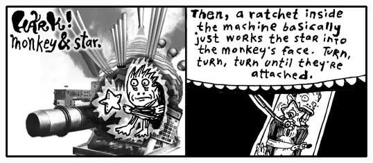

 

我从没有见过ham做除了渗水果汁之外的其他事情。今天，我们在Ambrose洞穴的业务是需要和精灵一起完成的。
他是下一课的重要组成部分。让我们都让他感到宾至如归。去加热你的聆听帽！（并请更换掉那些荒谬的箍筋裤子。）

温馨提示：这节课要慢很多。和它在一起。这将是一个漫长的过程，先做一个深呼吸。
这是你教程的最关键阶段。这看起来好像一开始你并没有学习多少代码。你将要先学习概念。
在这一章的最后，你将了解Ruby的美感。舒适的代码将成为你睡觉时的慰藉之物。

## 1. 叶子作为Ambrose的身份象征

好吧，精灵。给我们快速介绍下你王国遇到的货币问题。

是的，这和我的记忆不一样。这个精灵一直寻呼我。当握拒绝给他回话时，不知怎的，他在我的传呼机留了言。
我的意思是：它响了几次，然后打印出一张小纸条。小纸条的大意是，“快点趴下！”，还有，
“我们不得不摆脱这场企业毛毛虫的瘟疫，这些扭动的昆虫维京人正在使我的蓝水晶窒息！”

不久前：叶子和水晶的汇率已经安定下来。一颗成年的大树现在值5个水晶。所以，基础货币的情况是这样的：


blue_crystal = 1
leaf_tender = 5


这个例子中，和上一章的*totally*是一样的。仍然，这是一个开始。我们设置了两个*变量*。
**等号**用来*赋值*。

现在 `leaf_tender` 代表着数字 `5` （也就是：5个蓝水晶），在这里的意思是**红宝石(Ruby)的一半**。
我们在*定义*，我们在*创造*。这是我们工作的一半。赋值是最基本的定义方式。

但是你不能抱怨，精灵你可以吗？你已经建立了一个王国，可以兑现蓝水晶到森林生物的自由市场。
（即使他对我们来说是精灵，但对他们来说他是高大的怪兽）

<aside>

## 围巾食者

我讨厌在你的指导手册中打扰，但是我都已经走到这里了，我保证我会被进一步忽视。
我还可以跟着你到下一个项目吗？

我承诺了写另一本书（*长号[Trombone]*）。好消息是我实际上我没有写关于它的任何内容。
你将不必忍受这愚蠢而滔滔不绝的废话。

这是关于我和文字。我喜欢在附近徘徊并利用他们每一个，一个又一个，但是一切都是可预见的，
你说不是吗？最后，他们都将被使用，而我不得不编一些假话，这将不是舒适的方式。

现在，这笔交易还没有决定，但我在和Anna Quindlen谈判帮我代写的事情。我们准备合作写一本
吹捧正在你手中的这本（辛酸的）指南的书。坦率的说，这本指南毫无价值可言。你不能在上面堆足够的石榴。

所以这本新书，围巾食者，是一本人生成长小说。但它也是Macromedia Flash的初学者指南。
它就像Judy Blume经过的教堂，就像Hillary Duff主演的0sil8。

我确实不想泄露情节，但为了掉你的胃口，我只说这些：一个小孩在ActionScript中和他死去的哥哥对话。
更多惊喜敬请期待。

{{ sidebar | markdownify }}
</aside>

不不不，等一下。你还并不知道精灵要在他的洞穴里做什么。你会觉得这一切肯定是残忍的，不规矩的，
病态的，离奇古怪的...

### 现在你将要听到动物完美的使命宣言，因为这是一本书而且我们有时间又不着急，不是吗？

坐在快艇前面回来的路上，我遇到一只跌倒在跑道上的赛马，她之前获得很多奖项。她做了10个空翻然后撞上
一个拿着满罐蛋黄酱的家伙身上。蛋黄酱和血都洒在了跑道上。毋庸置疑，她是这场灾难的受害者。

兽医看了她一眼并宣誓她再也不能走路了。她的双腿都不见了，而兽医也不允许一个没腿的马坐在那里。
我们需要让她安息。他以他的生命和职业宣誓，并坚持让我们让我们分成两条平行线。那些无法反驳
医生请求的人在一边；那些固执的无法接受他万无一失的医疗理由的人在另一边。只有精灵，他的宠物ham和我
在第二线上。

所以，当其他人在那只马周围堆积奖杯和花圈，在子弹带她回家前对她温柔的告别时，精灵和我
在网络上疯狂的寻找解决方法。我们把东西拿到手中，使用活龙虾麻醉她受伤的大腿。这成功了！
我们现在又有了一只马，或者至少是：一匹身上带有硬皮腹霜的马。

之后她到处乱窜并在潮湿的地下洞穴里快乐的活了很多年。

现在动物完美是增强动物的未来。他们创造了新的动物零件用来抢救旧式的动物。当然，
他们已经走了很长的路。当完美动物工程开始后，你将看到走进完美动物室的是一只成年的熊，
走出来的是一只带着太阳镜的成年熊。相当的漂亮。

环顾四周，你将发现一只带着*喷气背包*的螃蟹。那是2004年最新型喷气螃蟹。

但是现在，所有的操作正生龙活虎的运行着。而且地面上是令人惊讶的清洁。所有的装备都
锃亮锃亮的。一切都镀着铬。哦，并且所有员工都藏着武器。他们训练有素，一旦有人进入
禁区就杀死他。或者，如果他们逃过了子弹，他们被训练成射杀任何进入禁区的人。

精灵，当我做一回猴子星星吧。

给你一些虚构的Ruby:


pipe.catch_a_star


变量 `pipe`，方法 `catch_a_star` 。很多Ruby开发者喜欢把方法作为消息。不管点前面是什么，
它都用来处理消息。上面的代码是告诉`炮管(pipe)`去`抓住一个星星(catch_a_star)`。

这是Ruby的**后半部分**。把事物运作起来。你在上半部分定义并创建事物，在下半部分*采取行动*。

1. 定义事物。
2. 把事物运作起来。

那么逮捕星星代码是怎么工作的呢？星星又是被带到什么地方去了呢？


captive_star = pipe.catch_a_star


你看，由你来收集这个悲惨的小星星。如果你不这么做，他就会消失。每当你使用一个方法时，
你将总会获得一些返回。你可以忽略它或者使用它。

_如果你能学会使用方法给你返回的答案，你将**占主导地位**_

然后快速的。


starmonkey = ratchet.attach( captive_monkey, captive_star )


该`棘轮(ratchet_)`获得了一个`附加(attach)`消息。需要附加什么？*方法参数*：
`俘获的猴子(captive_monkey)`和`俘获的星星(captive_star)`。我们获得一个`猴子星星(starmonkey)`的返回，
那是我们决定紧紧抓住的东西。

这原来是如此的短小，我将要把这所有连接成一个句子。


starmonkey = ratchet.attach( captive_monkey, pipe.catch_a_star ) + deco_hand_frog


看到`pipe.catch_a_star`是怎样正确的放在方法参数里面的了吗？抓住的星星将直接放到棘轮中。
不再需要找个地方把它放起来。就让他去吧。

## 2. Small and Nearly Worthless

Ambrose这里的旅馆并不好。粗糙的床，矮小的电梯。一个人把他的行李放在电梯就会发现没有他的空间了。
他按下按钮然后在后面追着电梯。但是楼梯太窄，他的肩膀被挤了起来。

他们给你提供的那间小肥皂吧，根本就是为侏儒准备的，所以根本起不了泡沫。我讨厌这里。
我就像带着隐形眼镜一样继续误会他们。

我打开水龙头，却什么也没出来。事情是这样的：Ambrose是一个魔法属性的地方，所以我就冒个险，
我把手放到水龙头下面。我感觉到无形的温水快速的流淌出来，流过我的手指。当我把手拿开时，
已经变干又清洁了。

这是一种惊人的虚无的体验。就像`nil`一样。

### Nil

在Ruby里，`nil`代表着空。它是一个**空值**，但不是0，0是一个数字。

It’s Ruby’s own walking dead, a flatlined keyword. You can’t add to it, it
doesn’t evolve. But it’s terribly popular. This skeleton’s smiling in all the
pictures.


plastic_cup = nil


The above `plastic_cup` is **empty**. You could argue that the `plastic_cup`
contains something, a `nil`. The `nil` represents the emptiness, though, so go
ahead and call it empty.

Some of you who have programmed before will be tempted to say the `plastic_cup`
is **undefined**. How about let’s not. When you say a variable is undefined,
you’re saying that Ruby simply has no recollection of the variable, it doesn’t
know the var, it’s absolutely non-existent.

But Ruby is aware of the `plastic_cup`. Ruby can easily look in the
`plastic_cup`. It’s **empty**, but not **undefined**.

### False

_The cat Trady Blix. Frozen in emptiness. Immaculate whiskers rigid. Placid eyes
of lake. Tail of warm icicle. Sponsored by a Very Powerful Pause Button._

The darkness surrounding Blix can be called **negative space**. Hang on to that
phrase. Let it suggest that the emptiness has a negative connotation. In a
similar way, `nil` has a slightly sour note that it whistles.

Generally speaking, **everything in Ruby has a positive charge to it**. This
spark flows through strings, numbers, regexps, all of it. Only two keywords wear
a shady cloak: `nil` and `false` draggin’ us down.

You can **test that charge** with an `if` keyword. It looks very much like the
`do` blocks we saw in the last chapter, in that both end with an `end`.


if plastic_cup
  print "Plastic cup is on the up 'n' up!"
end


If `plastic_cup` contains either `nil` or `false`, you won’t see anything print
to the screen. They’re not on the `if` guest list. So `if` isn’t going to run
any of the code it’s protecting.

But `nil` and `false` need not walk away in shame. They may be of questionable
character, but `unless` runs a smaller establishment that caters to the
bedraggled. The `unless` keyword has a policy of **only allowing those with a
negative charge in**. Who are: `nil` and `false`.


unless plastic_cup
  print "Plastic cup is on the down low."
end


You can also use `if` and `unless` at the **end of a single line of code**, if
that’s all that is being protected.


print "Yeah, plastic cup is up again!" if plastic_cup
print "Hardly. It's down." unless plastic_cup


And another nice trick: stack the `if` and `unless`.


print "We're using plastic 'cause we don't have glass." if plastic_cup unless glass_cup


This trick is a gorgeous way of expressing, _Do this only if **a* is true and
*b** isn’t true_.

Now that you’ve met `false`, I’m sure you can see what’s on next.

<aside>

## Make Your Own Starmonkey!

1. Turn a mug upside-down. 
2. Attach an apple with a rubber band. 
3. Shove car keys into the sides of the apple. 
4. Glue star face. 

You have two complementary star faces waiting in your account.

Standard, placid.

Eating chalk.


{{ sidebar | markdownify }}
</aside>

### True


approaching_guy = true


I saw `true` at the hotel buffet tables today. I cannot stand that guy. His
stance is way too wide. And you’ve never met anyone who planted his feet so hard
in the ground. He wears this corny necklace made out of shells. His face exudes
this brash confidence. (You can tell he’s exerting all of his restraint just to
keep from bursting into Neo flight.)

To be honest, I can’t be around someone who always has to be right. This `true`
is always saying, “A-OK.” Flashing hang ten. And seriously, he loves that
necklace. Wears it constantly.

As you’d suspect, he’s backstage at everything on the `if` event schedule.

`print "Hugo Boss" if true` acts like `print "Hugo Boss"`.

Occassionally, `if` will haul out the velvet ropes to exercise some crowd
control. The **double equals** gives the appearance of a short link of ropes,
right along the sides of a red carpet where only `true` can be admitted.


if approaching_guy == true
 print "That necklace is classic."
end


The double equals is simply **an ID check**. Do the gentleman at both ends of
this rope appear to match?

In this way, you control who `if` lets in. If you have a hard time getting along
with `true` as I do, you can heartily welcome `false`.


if approaching_guy == false
  print "Get in here, you conniving devil."
end


Same goes for `unless`. The gateway is yours. Take possession of it.

### Again, I Want You to Dominate

Now, you want a head trip? **The double equals sign is a method.** Can you guess
how it works? Here, check it out with the dot and parens:


approaching_guy.==( true )


Ruby allows the shortcut, though. You can drop the dot and back away slowly.

Now, do you remember what you need to do to **dominate** in Ruby? _Use the
answers the methods give you._


if nil.==( true )
  print "This will never see realization."
end


In the above, how is the method’s answer being used?

Let’s take the statement `nil.==(true)`. This will fail every time. No match. When
there’s no match, the double equals method answers with `false`. A shake of the
head. That answer is given to `if`, who can’t accept a `false`. The `print`
never sees realization.


at_hotel = true
email = if at_hotel
          "why@hotelambrose.com"
        else
          "why@drnhowardcham.com"
        end


Even though `if` isn’t a method, `if` does give a return answer. Look at the
above and wonder over what happens when `at_hotel` is `true`.

The `if` will return the answer given by the code it chooses to run. In the case
of `at_hotel` being true, the first string, my e-mail address at Hotel Ambrose,
will be returned. The `else` keyword marks code which will run, should `if`
fail. If `at_hotel` is false, the `if` will answer with my e-mail address at Dr.
N. Howard Cham’s office, where I take my apprenticeship.

Should you have several lines of code in an `if` or `unless`, **only the answer
from the last full statement will be used**.


email = if at_hotel
          address = "why"
          address << "@hotelambrose"
          address << ".com"
        end


Three lines of code inside the `if`. The first line assigns a string with my
name in it to a variable. The second and third lines add the rest of my e-mail
address on to the end. The **double less-than `<<` is the concatenation
operator**. To concatenate is to **append**, or **add to the end**.

Just as we saw with the equality checker `==`, the concatenator is a method.
After adding to the end of the string, the concatenator also **answers with that
very string**. So, the third line, which could be read as `address.<<( ".com"
)`, gives back `address`, which the `if` then hands back for `email`'s
assignment.

Here’s a question: what if the `if` fails? What if `at_hotel` is false in the
above example? Is anything returned? Nothing is assigned to `email`, right?

Yes, nothing is returned. By which I mean: `nil` is returned. And often `nil` is
a very useful answer.


print( if at_hotel.nil?
         "No clue if he's in the hotel."
       elsif at_hotel == true
         "Definitely in."
       elsif at_hotel == false
         "He's out."
       else
         "The system is on the freee-itz."
       end )


You can use the `nil?` method on any value in Ruby. Again, think of it as a
message. To the value: “Are you nil? Are you empty?”

If `at_hotel` is empty, Ruby doesn’t have any idea if I’m in the hotel or not.
So `if` answers with the “No clue” string. In order to handle the `true` or
`false` possibilities, the `elsif` keyword is used. While you can have only one
`if` and one `else`, you can fill the in-between with an exorbitant number of
`elsif` keywords. Each `elsif` acts as **a further `if` test**. Checking for a
positive charge.

If you’re doing okay at this point, then you’re in tip-top shape for the rest of
the book. You have seen some pretty tough code in the last few examples. You
strong fellow.

## 3. Chaining Delusions Together

You finish reading the above comic and retire to your daybed for reflection.
It’s one of those canopy affairs which is always logjammed with pillows. You sit
atop the pile, gazing out upon the world. You see the tall smokestacks belching
wide spools of fume and haze. The tangled concourses of freeways smattered with
swift, shimmering traffic is but a gently pulsing eye muscle from your vantage
point.

It is all so fantastic. How the colors of the horizon spread across the
landscape as a great mix of butter and grease with a tablespoon of vanilla
extract.

Yet, for all of the beauty which beckons for your attention, the images of the
Elf and his Olympic Hopeful return. And more especially, that order for
**55,000** starmonkeys. _55,000 starmonkeys_, you think. _Fifty-five Thousand_.

You think of just the number itself. _55,000_. It’s walking down a road. It
might be in a forest, you don’t know for sure as your eyes are fixed right on
the number itself. It’s stopping and talking to people. To tennis players, to a
men’s choral group. There is merriment and good feeling. When it laughs, its
lower zeros quiver with glee.

You want to talk to it. You want to skip along that forest trail with it. You
want to climb aboard a jet bound to Brazil with it. And after five days and four
nights at the leisureful Costa do Sauipe Marriott Resort & Spa, to marry it, to
bear a family of 55,000 starmonkeys with it. To take possession of Nigeria with
it.

With a flying leap, you dismount your pillow tower of isolation. Scrambling with
the key, you unlock your roll top desk and pull out a sheet of paper, holding it
firmly upon the desk. You begin scribbling.

> _Take possession of Nigeria with my new 55,000 starmonkeys_... _Over it, build
> Nigeria-sized **vegetarians only** casino and go-cart arena_... _Wings… we
> could have our own special sauce on the wings that’s different_... _Mustard +
> codeine = Smotchkkiss’ Starry Starmonkey Glow Sauce_... _Franchise, franchise…
> logos_... _Employee instructional videos_... _When you give the customer
> change, let them reach inside the frog on your hand to get it_... _If they
> have no change, at least put their reciept some place where they have to touch
> the frog_... _We’re leveling the playing field here_... _Advertise cheap
> pizza, let’s make our money off soda_... _Collect all 4 frosted glasses_...

Wow, the ideas are really coming out. You literally had to smack yourself to
stop. We need to put these in a safe place. Actually, we should store them on
your computer and mangle the words. You look out the window and watch for FBI. I’m going to start this script.

### The Flipping Script


print "Type and be diabolical: "
idea_backwards = gets.reverse


Let this script be your confidante. It will ask for evil plans and turn their
letters backwards. The `gets` method is **built into Ruby**. It’s a **kernel
method** like `print`. This method `gets` will pause Ruby to let you type. When
you hit _Enter_, `gets` will then stop paying attention to your keyboard
punchings and answer back to Ruby with a string that contains everything you
typed.

<aside>

## Get Ahead with The Tiger’s Vest

[][1]

Want to start using Ruby alongside your reading? Split your attention and head
off to [Expansion Pak I: The Tiger’s Vest][1], a trite mini-chapter which will
aid you in installing Ruby. In addition, you’ll learn how to use Irb and Ri, two
teaching aids that come with Ruby which will really speed you up in your
learning.

[1]: expansion-pak-1.html

{{ sidebar | markdownify }}
</aside>

The `reverse` method is then used on the string that `gets` is giving back. The
`reverse` method is part of the `String` class. Which means that **anything
which is a string has the `reverse` method available**. More on classes in the
next chapter, for now just know that **a lot of methods are only available with
certain types of values**.

I don’t think `reverse` is going to cut it. The authorities only need to put a
mirror to “airegiN fo noissessop ekaT.” Bust us when starmonkeys start to touch
down in Lagos.

The capital letters give it away. Maybe if we uppercase all letters in the
string before we reverse it.


idea_backwards = gets.upcase.reverse


### Your Repetitiveness Pays Off

You hand me a legal pad, doused in illegible shorthand. Scanning over it, I
start to notice patterns. That you seem to use the same set of words repeatedly
in your musings. Words like _starmonkey_, _Nigeria_, _firebomb_. Some phrases
even. _Put the kabosh on._ That gets said a lot.

Let us disguise these foul terms, my brother. Let us obscure them from itching
eyes that cry to know our delicate schemes and to thwart us from having great
pleasure and many go-carts. We will replace them with the most innocent
language. New words with secret meaning.

I start up a word list, a Ruby `Hash`, which contains these oft seen and
dangerous words of yours. In the Hash, each dangerous word is matched up against
a code word (or phrase). The code word will be swapped in for the real word.


CODE_WORDS = {
  'starmonkeys' => 'Phil and Pete, those prickly chancellors of the New Reich',
  'catapult' => 'chucky go-go', 'firebomb' => 'Heat-Assisted Living',
  'Nigeria' => "Ny and Jerry's Dry Cleaning (with Donuts)",
  'Put the kabosh on' => 'Put the cable box on'
}


The words which are placed before the arrow are called **keys**. The words after
the arrows, the definitions, are often just called **values**.

Notice the double quotes around `Ny and Jerry's Dry Cleaning (with Donuts)`.
Since a single quote is being used as an apostrophe, we can’t use single quotes
around the string. (Although, you can use single quotes if you put a backslash
before the apostrophe such as: `'Ny and Jerry\'s Dry Cleaning (with Donuts)'`.)

Should you need to look up a specific word, you can do so by using the **square
brackets** method.

`CODE_WORDS['catapult']` will answer with the string `'chucky go-go'`.

Look at the square brackets as if they are a wooden pallet the word is sitting
upon. A forklift could slide its prongs into each side of the pallet and bring
it down from a shelf back in the warehouse. The word on the pallet is called the
_index_. We are asking the forklift to find the index for us and bring back its
corresponding value.

If you’ve never been to a warehouse, you could also look at the brackets as
handles. Imagine an industrious worker putting on his work gloves and hefting
the index back to your custody. If you’ve never used handles before, then I’m
giving you about thirty seconds to find a handle and use it before I blow my
lid.

As with many of the other operators you’ve seen recently, the index brackets are
simply a shortcut for a method.

`CODE_WORDS.` will answer with the string `'chucky go-go'`.

### Making the Swap

I went ahead and saved the Hash of code words to a file called **wordlist.rb**.


require_relative 'wordlist'

# Get evil idea and swap in code words
print "Enter your new idea: " 
idea = gets
CODE_WORDS.each do |real, code| 
  idea.gsub!( real, code )
end

# Save the jibberish to a new file
print "File encoded.  Please enter a name for this idea: " 
idea_name = gets.strip
File::open( "idea-" + idea_name + ".txt", "w" ) do |f|
  f << idea
end


Script starts by pulling in our word list. Like `gets` and `print`, the
`require_relative` method is a kernel method, you can use it anywhere. I give it the
string `'wordlist'` and it will look for a file named `wordlist.rb`.

After that, there are two sections. I am marking these sections with comments,
the lines that start with **pound** symbols. Comments are **useful notes** that
accompany your code. Folks who come wandering through your code will appreciate
the help. When going through your own code after some time has passed, comments
will help you get back into your mindset. And there’s software out there that
can take your comments and build documents from them. (RDoc and Ri—see Expansion
Pak #1!)

I like comments because I can skim a big pile of code and spot the highlights.

As the comments tell us, the first section asks you for your evil idea and swaps
in the new code words. The second section saves the encoded idea into a new text
file.


CODE_WORDS.each do |real, code|
  idea.gsub!( real, code )
end


You see the `each` method? The `each` method is all over in Ruby. It’s available
for Arrays, Hashes, even Strings. Here, our `CODE_WORDS` dictionary is kept in a
Hash. This `each` method will hurry through **all the pairs of the Hash**, one
dangerous word matched with its code word, handing each pair to the `gsub!`
method for the actual replacement.

In Ruby, `gsub` is short for _global substitution_. The method is used to search
and replace. Here, we want to find all the occurrences of a dangerous word and
replace with its safe code word. With `gsub`, you provide the **word to find as
the first argument**, then the **word to put in its place as the second
argument**.

Why aren’t we hanging on to the answer from `gsub`? Doesn’t `gsub` give us an
answer back that we should keep? You’d think the line would read:


safe_idea = idea.gsub( real, code )


Yes, with `gsub` we’d need to hang on to its answer. We’re using a variation of
`gsub` that is totally hyper. Notice the **exclamation mark** on the `gsub!`
used inside the `each` block. The exclamation mark is a sign that `gsub!` is a
bit of a zealot. See, `gsub!` will go ahead and **replace the words in `idea`
directly**. When it’s done `idea` will contain the newly altered string and you
won’t be able to find the old string.

Call `gsub!` a **destructive method**. It makes its changes to the value
directly. Whereas `gsub` will leave the value intact, answering back with a new
string which contains the alterations. (Why must `gsub!` scream when he descends
upon his prey? Merciless assailant!)

### Text Files of a Madman

Let us now save the encoded idea to a file.


# Save the jibberish to a new file
print "File encoded.  Please enter a name for this idea: "
idea_name = gets.strip
File::open( 'idea-' + idea_name + '.txt', 'w' ) do |f|
  f << idea
end


This section starts by asking you for a name by which the idea can be called.
This name is used to build a file name when we save the idea.

The `strip` method is for strings. This method **trims spaces and blank lines**
from the **beginning and end** of the string. This will remove the _Enter_ at
the end of the string you typed. But it’ll also handle spaces if you
accidentally left any.

After we have the idea’s name, we open a new, blank text file. The file name is
built by adding strings together. If you typed in `'mustard-plus-codeine'`, then
our math will be: `'idea-' + 'mustard-plus-codeine' + '.txt'`. Ruby presses
these into a single string. `'idea-mustard-plus-codeine.txt'` is the file.

We’re using the class method `File::open` to create the new file. Up until now,
we’ve used several kernel methods to do our work. We hand the `print` method a
string and it prints the string on your screen. One secret about kernel methods
like `print`: they are actually **class methods**.


Kernel::print( "55,000 Starmonkey Salute!" )


What does this mean? Why does it matter? It means `Kernel` is the center of
Ruby’s universe. Wherever you are in your script, `Kernel` is right beside you.
You don’t even need to spell `Kernel` out for Ruby. Ruby knows to check
`Kernel`.

Most methods are more specialized than `print` or `gets`. Take the `File::open`
for example. The creator of Ruby, Matz, has given us many different methods
which which read, rename, or delete files. They are all organized inside the
`File` class.

* `File::read( "idea-mustard-plus-codeine.txt" )` will answer back with a string
  containing all of the text from your idea file.
* `File::rename( "old_file.txt", "new_file.txt" )` will rename `old_file.txt`.
* `File::delete( "new_file.txt" )` will nuke the new file.

These File methods are all **built right into Ruby**. They are all just stored
in a container called the `File` class. So, while you can safely call kernel
methods without needing to type `Kernel`, Ruby doesn’t automatically check the
`File` class. You’ll need to give the full method name.


File::open( 'idea-' + idea_name + '.txt', 'w' ) do |f|
  f << idea
end


We pass two arguments into `File::open`. The first is the **file name to open**.
The second is a string containing our **file mode**. We use `'w'`, which means
to write to a brand-new file. (Other options are: `'r'` to read from the file or
`'a'` to add to the end of the file.)

The file is opened for writing and we are handed back the file in variable `f`,
which can be seen **sliding down the chute into our block**. Inside the block,
we write to the file. When the block closes with `end`, our file is closed as
well.

Notice we use the **concatenator** `<<` to write to the file. We can do this
because files have a method called `<<` just like strings do.

### Settle Down, Your Ideas Aren’t Trapped

Here, let’s get your ideas back to their original verbage, so you can rumminate
over their brilliance.


require_relative 'wordlist'

# Print each idea out with the words fixed
Dir['idea-*.txt'].each do |file_name|
  idea = File.read( file_name )
  CODE_WORDS.each do |real, code|
    idea.gsub!( code, real )
  end
  puts idea
end


By now, you should be up to snuff with most of this example. I won’t bore you
with all of the mundane details. See if you can figure out how it works on your
own.

We have an interesting class method here, though. The `Dir::[]` method searches
a directory (some of you may call them “folders”). Just as you’ve seen with
Hashes, the index brackets can be class methods. (Can you start to see the
shiny, glinting gorgeousness of Ruby?)

So we’re using the forklift to get those files in the directory which match
`'idea-*.txt'`. The `Dir::[]` method will use the asterisk as a wildcard. We’re
basically saying, “Match anything that starts with _idea-_ and ends with
_.txt_.” The forklift shuffles off to the directory and comes back with a list
of all matching files.

That **list of files** will come in the form of `Array` the Caterpillar, with a
`String` for each file. If you are curious and want to play with with `Dir::[]`,
try this:


p Dir['idea-*.txt']
#=> ['idea-mustard-plus-codeine.txt'] - an Array of file names!


Yes, the `p` method works like `print`. But where `print` is designed for
displaying strings, `p` will print _anything_. Check this out.


p File::methods
#=> ["send", "display", "name", "exist?", "split", ...]


## 4. The Miracle of Blocks

<aside>

## Excerpt from The Scarf Eaters

(_from Chapter V: A Man in Uniform_.)

In April, the callow lilies came back. They stretched their baby angel wings out
and reached for the world. Gently, their tendrils caressed the sullen fence
posts until even they lilted lovelier.

From her bedroom window, Lara watched the lilies exude their staunch femininity.
She slipped the tassels of a fresh, carpathian, embroidered scarf into her mouth
and ate slowly. The long cloth slid down her throat and tickled as it snaked
along her esophagus. She giggled and burped.

Oh, how the flora drew her in. Looking at flowers went so well with being a
teenage girl. She wanted to paint them, so she opened a new Flash template. A
blank movie this time.

She set her cursor loose in the garden of her movie’s viewable area. Vector
white lines below shorter vector yellow lines. She selected the white lines and
grouped them together. She even moved them to a new layer entitled “Cry, Baby
Angel, Cry.” Then she converted them into a graphic object and moved them to the
library.

She felt a warm chill as she moved the long, white petals to her movie’s
library. It felt so official. _I choose you. I name you. Dwell in the comfort of
my palace forevermore._

Heh. She laughed. Colorado Springs was hardly a “palace.”

Since they had moved, Dad had only been home once. He had barged through the
front door in full uniform and had given quite a start to both Lara and her
mother. Her mother had even dropped a head of lettuce—which head she had just
finished washing—in a pitcher of Lick-M-Aid.

The pitcher was just wide enough for the lettuce and it lodged in there pretty
good. Dad came over and yanked at the moist head for sometime until declaring it
FUBAR, in a voice both bemused and then crestfallen.
He tossed the clotted spout in the trash bin.

It was only later that day that Lara’s mother realized that she could have
simply halved the lettuce with an electric knife. Dad laughed and slapped his
forehead. He then went around and slapped Lara’s forehead, and her mother’s too,
affectionately.

“We just weren’t thinking, were we?” is what he said. “And who dares blame us?
We’re a real family today. And we shouldn’t have to do anything else on the day
we got our family back.”

Lara’s smiled reflected across the glass of her monitor. She chose the text tool
and in 42 point serif typed: “Dad.” She created a path for it and let it tween
off the right side of the screen. She cried long after it was gone.

{{ sidebar | markdownify }}
</aside>

Since you and I are becoming closer friends as we share this time together, I
should probably let you in on a bit of the history going on here. It’s a good
time for a break I say.

First, you should know that Blix is my cat. My second pet to Bigelow. Granted,
we hardly see each other anymore. He’s completely self-sufficient. I’m not
exactly sure where he’s living these days, but he no longer lives in the
antechamber to my quarters. He emptied his savings account about seven months
ago.

He does have a set of keys for the house and the Seville. Should he ever find
himself stranded, I will gladly step away from our differences and entertain his
antics around the house again.

Make no mistake. I miss having him around. Can’t imagine he misses my company,
but I miss his.

### A Siren and A Prayer

I first saw Blix on television when I was a boy. He had a starring role on a
very gritty police drama called _A Siren and A Prayer_. The show was about a
god-fearing police squad that did their jobs, did them well, and saw their share
of miracles out on the beat. I mean the officers on this show were _great_ guys,
very religious, practically clergy. But, you know, even clergymen don’t have the
good sense to kill a guy after he’s gone too far. These guys knew where to draw
that line. They walked that line every day.

So, it was a pretty bloody show, but they always had a good moral at the end.
Most times the moral was something along the lines of, “Wow, we got out of that
one quick.” But there’s serious camaraderie in a statement like that.

The show basically revolved around this one officer. “Mad” Dick Robinson. People
called him Mad because he was basically insane. I can’t remember if he was
actually clinically insane, but people were always questioning his decisions.
Mad often blew his top and chewed out some of the other officers, most of whom
had unquestionable moral character. But we all know it’s a tough world, the
stakes are high out there, and everyone who watched the show held Mad in great
regard. I think everyone on the squad grew quite a bit as people, thanks to
Mad’s passion.

The officers couldn’t do it all themselves though. In every single episode, they
plead with a greater force for assistance. And, in every single episode, they
got their tips from a cat named Terry (played by my cat Blix.) He was just a
kitten at the time and, as a young boy tuning into _A Siren and A Prayer_, I
found myself longing for my own crime-sniffing cat. Terry took these guys down
the subway tunnels, through the rotting stench of abandoned marinas, into
backdoors of tall, industrial smokestacks.

Sometimes he was all over an episode, darting in and out, preparing traps and
directing traffic. But other times you wouldn’t see him the whole episode. Then
you’d rewind through the whole show and look and look and look. You’d give up.
He can’t be in that episode.

Still, you can’t bear to let it go, so you go comb through the whole episode
with the jog on your remote, combing, pouring over each scene. And there he is.
Way up behind the floodlight that was turned up too high. The one that left Mad
with permanent eye damage. Why? Why burn out the retinas of your own colleague,
Terry?

But the question never got answered because the series was cancelled. They
started to do special effects with the cat and it all fell apart. In the last
episode of the show, there is a moment where Terry is trapped at the top of a
crane, about to fall into the searing slag in the furnace of an iron smelt. He
looks back. No going back. He looks down. Paws over eyes (_no joke!_), he leaps
from the crane and, mid-flight, snags a rope and swings to safety, coming down
on a soft antelope hide that one of the workers had presumably been tanning that
afternoon.

People switched off the television set the very moment the scene aired. They
tried changing the name. First it was _God Gave Us a Squad_. _Kiss of Pain_.
Then, _Kiss of Pain in Maine_, since the entire precinct ended up relocating
there. But the magic was gone. I went back to summer school that year to make up
some classes and all the kids had pretty much moved on to football pencils.

### Blocks

A couple years ago, I started teaching Blix about Ruby. When we got to this part
in his lessons, the part that covers blocks, he said to me, “Blocks remind me of
Mad Dick Robinson.”

“Oh?” I hadn’t heard that name in awhile. “I can’t see how that could be.”

“Well, you say blocks can be difficult to understand.”

“They’re not difficult,” I said. “A **block** is just **code that’s grouped
together**.”

“And Mad was just an officer, sworn to uphold his duty,” he said. “But he was a
real miracle to watch out in the field. Now, this first example you’ve shown
me…” He pointed to an example I’d written down for him.


kitty_toys =
  [:shape => 'sock', :fabric => 'cashmere'] +
  [:shape => 'mouse', :fabric => 'calico'] +
  [:shape => 'eggroll', :fabric => 'chenille']
kitty_toys.sort_by { |toy| toy[:fabric] }


“This is a small miracle,” he said. “I can’t deny its beauty. Look, there are my
kitty toys, laid out with their characteristics. Below them, the block, sorting
them by fabric.”

“I apologize if your list of toys looks a bit tricky,” I said. Like you, he had
learned about the Array, the caterpillar stapled into the code, with square
brackets on each side and each item separated by commas. (Ah, here is one:
`['sock', 'mouse', 'eggroll']`.) He had also been taught the Hash, which is like
a dictionary, with curly braces on each end which look like small, open books.
Commas in the Hash between each pair. Each word in the dictionary matched up
with its definition by an arrow. (Be beholden:
`{'blix' => 'cat', 'why' => 'human'}`.)

“Yes, vexing,” he said. “It has square brackets like it’s an Array, but with the
arrows like it’s a Hash. I don’t think you’re going to get away with that.”

“It does seem a bit subversive, doesn’t it?” I said, tease-nudging him with a
spoon. “I’ve done your kitty toy list in a mix of the two. I’m using a shortcut.
Which is: **If you use arrows inside of an Array, you’ll end up with a Hash
inside of that Array.**“

“Oh, I see,” he said. “You criss-crossed ‘em. How neat!”

“Yes, yes, you’re on it,” I said. He was also very good with a protractor. “I
have three Arrays, each with a Hash inside. Notice the plus signs? I’m adding
them into one big Array. Here’s another way of writing it…” I jotted down.


kitty_toys = [
  {:shape => 'sock', :fabric => 'cashmere'},
  {:shape => 'mouse', :fabric => 'calico'},
  {:shape => 'eggroll', :fabric => 'chenille'}
]


One Array, which acts as our list of chew toys. Three Hashes in the Array to
describe each toy.

### Sorting and Iterating to Save Lives

“Let’s sort your toys by shape now,” I said. “Then, we’ll print them out in that
order.”


kitty_toys.sort_by { |toy| toy[:shape] }.each do |toy|
  puts "Blixy has a #{ toy[:shape] } made of #{ toy[:fabric] }"
end


“How does `sort_by` work?” asked Blix. “I can tell it’s a method you can use
with Arrays. Because `kitty_toys` is an Array. But what is `toy`?”

“Okay, `toy` is a **block argument**,” I said. “Remember: the skinny pipes on
each side of `toy` make it a **chute**.”

“Sure, but it looks like you’re using it like a Hash. Inside the block you have
`toy[:shape]`. That looks like a Hash.”

“The `sort_by` method is an **iterator**, Blix. It **iterates**, or **cycles**,
through **a list of things**. You remember that episode when Mad…”

“Episode?” he said. Yeah, he can’t understand the concept of TV dramas. Yeah,
I’ve tried explaining.

“Or, yeah, remember that one _eyewitness account_ we watched where Mad was
trying to talk down that crazy spelling bee contestant from the ledge of an
college library?”

“I remember it better than you because I was riding in a remote control plane.”
Yep, it was one of those episodes.

“Do you remember how Mad got the guy to come down?” I asked.

“People in spelling bees love letters,” said Blix. “So what Mad did was a genius
move on his part. He started with the letter A and gave reasons, for all the
letters of the alphabet, why the guy should walk back down the building and be
safe on the ground.”

”’A is for the Architecture of buildings like this,’” I said, in a gruff Mad
voice. ”’Which give us hope in a crumbling world.’”

”’B is for Big Guys, like your friend Mad the Cop,’” said Blix. ”’Guys who help
people all the time and don’t know how to spell too great, but still help guys
who spell really great.’”

“See, he went through all the letters, one at a time. He was _iterating_ through
them.” _It Err Ate Ing._

“But the guy jumped anyway, Why. He jumped off on letter Q or something.”

”’Q is for Quiet Moments that help us calm down and think about all of life’s
little pleasures, so we don’t get all uptight and starting goofing around on
tiptoes at the very edge of a big, bad building.’”

“And then he jumped,” said Blix. He shook his head. “You can’t blame Mad. He did
his best.”

“He had a big heart, that’s for sure,” I said, patting Blix on the shoulder.


kitty_toys.sort_by { |toy| toy[:shape] }.each do |toy|
  puts "Blixy has a #{ toy[:shape] } made of #{ toy[:fabric] }"
end


“As for your `sort_by`, it **starts at the top** of the list and **goes through
each item**, one at a time. So `toy` is one of those items. With each item,
`sort_by` stops and **slides that item down the chute**, under the `toy` name,
and let’s you figure out what to do with it.”

“Okay, so `toy` takes turns being each of the different toys I have.”

“That’s right,” I said. “You know how I’ve really been harping on _using the
answers that methods give you_? Here, we’re simply looking up the toy’s shape
inside the block. The block then answers to `sort_by` with the shape string,
such as `"mouse"` or `"sock"`. Once it’s done cycling through the whole list,
`sort_by` will have alphabetically compared each of the shape strings and will
give back a new sorted Array.”

### An Unfinished Lesson

“That’s good enough for today,” said Blix. “Can I have a fresh saucer of milk,
please?”

I filled his saucer to the brim and he guzzled from it for some time while I
took a poker and jabbed at coals in the fireplace. My mind wandered and I
couldn’t help but think further of blocks. I wondered what I would teach Blix
next.

I probably would have taught him about `next`. When you are iterating through a
list, you may use `next` to **skip on to the next item**. Here we’re counting
toys that have a non-eggroll shape by skipping those that do with `next`.


non_eggroll = 0
kitty_toys.each do |toy|
  next if toy[:shape] == 'eggroll'
  non_eggroll = non_eggroll + 1
end


I could also have taught him about `break`, which **kicks you out of an
iterating loop**. In the code below, we’ll print out (with `p`) each of the toy
Hashes until we hit the toy whose fabric is chenille. The `break` will cause the
`each` to abruptly end.


kitty_toys.each do |toy|
  break if toy[:fabric] == 'chenille'
  p toy
end


I never got to teach him such things. I continued poking away at a particularly
stubborn coal which was caught in the iron curtain of the fireplace and
threatened to drop on my antelope skin rug.

As I hacked away ferociously at the black stone, Blix slipped away, presumably
on the bus bound for Wixl, the very bustling metropolis of the animal economies.
Who knows, he may have first stopped in Ambrose or Riathna or any of the other
villages along the way. My instinct say that Wixl was his definitely his final
stop.

Without any student to instruct and coax along, I found myself quite lonely,
holed up in the estate. In the stillness of the dead corridors, I began to
sketch out a biography in the form of this guide.

I worked on it whenever I found myself bored. And when I wasn’t bored, I could
always switch on _The Phantom Menace_ to get me in the mood.

